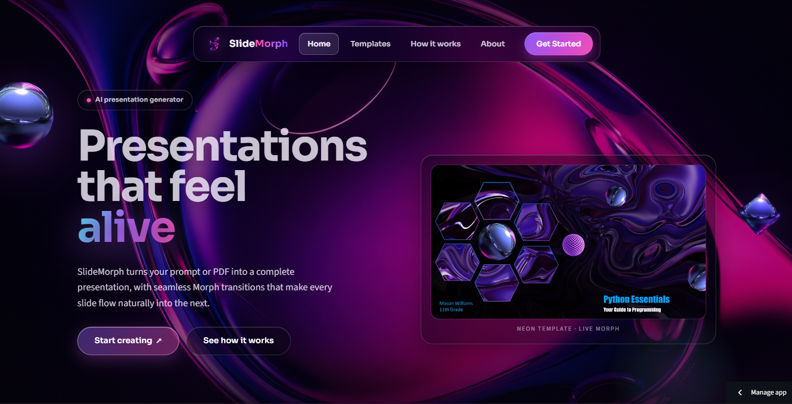
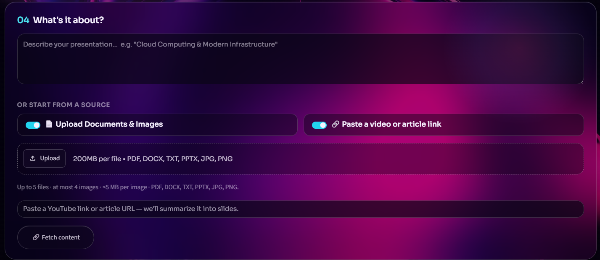
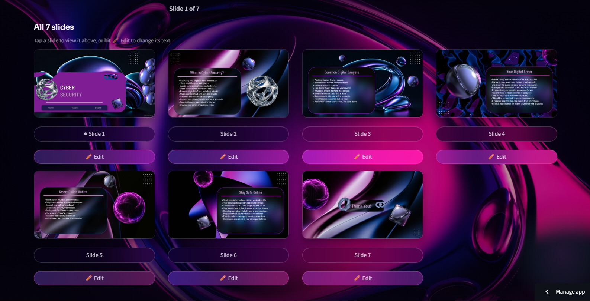
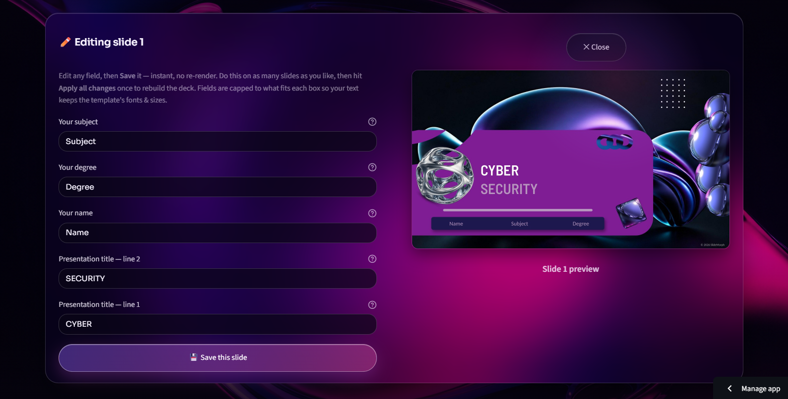

# SlideMorph

## AI-Powered Presentations with Professional Morph Transitions

**Live at:** https://slidemorph.streamlit.app/

---

# 1. What Is SlideMorph?

SlideMorph is an AI-powered presentation generator that turns a topic, document, or link into a complete, download-ready PowerPoint file — complete with professional Morph transitions already wired between every slide. The user provides the subject matter; SlideMorph handles the outline, writing, layout, and animation.

Most AI presentation tools produce static text slides. SlideMorph goes further: its templates are carefully engineered so that PowerPoint's Morph transition engine can identify matching shapes across slides and animate them fluidly — shapes glide, transform, and reposition as if the entire deck were a short film.

This is not a cosmetic add-on; it is the architectural foundation of every template in the app.

---

# 2. How It Works

The user experience follows a simple five-step flow.

## 🎨 1. Select a Template

Choose from four professionally designed templates — **Neon, Aurora, Frost, or Nova**. Each template has its own visual style and is specifically engineered for Morph transitions.

---

## ⚙️ 2. Configure Your Presentation

Set the deck length, depth level, and presentation type before generation.

### Deck Length
- Quick
- Standard
- Detailed
- Complete

### Depth
- Beginner
- Intermediate
- Advanced

### Presentation Type
- General
- Coding
- Math

---

## 📚 3. Provide Your Content

Enter a topic directly or provide supporting material.

SlideMorph accepts:

- Text prompts
- PDF
- DOCX
- TXT
- PPTX
- Images
- Web articles
- YouTube videos

Up to **five sources** can be combined in a single generation.

Multiple sources can be combined into a single presentation, allowing SlideMorph to build a more complete understanding of the topic.

---

## 🤖 4. AI Generation

SlideMorph analyzes the provided material, filters irrelevant information, builds a structured presentation outline, and generates the content for each slide.

The generation process is shown through a live progress interface so the user can follow what the system is doing.

---

## ✏️ 5. Review & Edit

Once generation is complete, the presentation can be browsed directly inside the application.

Text can be edited directly from the browser before exporting the final presentation.

---

## 📥 Export Your Presentation

When the presentation is ready, SlideMorph provides two export options.

### PowerPoint

Download the complete `.pptx` presentation with the layouts, fonts, and Morph transitions preserved.

### Word Document

The presentation content can also be exported as a `.docx` document containing the slide headings and bullet points.

---

# 3. 🚀 Key Capabilities

## 📚 Multi-Source Input

SlideMorph can work with information from multiple different sources instead of relying only on a single text prompt.

It supports:

- Typed prompts
- PDF documents
- DOCX documents
- TXT files
- PPTX files
- Images
- Web articles
- YouTube videos

Up to five sources can be combined in a single generation.

A two-level filtering system automatically removes irrelevant material before the presentation is generated. Sources are also identified and grouped intelligently. For example, sequential pages of scanned notes can be treated as one document rather than unrelated individual sources.

---

# 💻 Three Generation Modes

SlideMorph provides three specialized generation modes.

## 🌐 General Mode

General Mode produces clear, accessible presentation content suitable for a wide range of subjects.

---

## 💻 Coding Mode

Coding Mode is designed for technical and programming presentations.

It generates code-heavy slides with complete, properly indented code examples using fixed-width formatting.

---

## ∫ Math Mode

Math Mode is designed specifically for mathematical presentations.

Equations and derivations are rendered as real mathematics, including:

- Fractions
- Integrals
- Roots
- Limits
- Summations
- Multi-step derivations

The mathematics rendering system is built into the application and does not require a separate LaTeX installation.

---

# 🎬 Morph-First Template Design

This is the core idea behind SlideMorph.

The four templates — **Neon, Aurora, Frost, and Nova** — are not ordinary presentation templates with the Morph transition simply turned on.

Every slide is designed with the next slide in mind.

Elements are deliberately:

- Positioned
- Sized
- Named
- Rotated
- Grouped
- Repositioned

so that PowerPoint's Morph engine can identify matching shapes and understand how they should transform between slides.

Instead of every slide feeling like a separate page, elements can move naturally from one state to another.

Shapes glide, transform, resize, rotate, and reposition between slides, creating visual continuity throughout the presentation.

Creating templates with this level of Morph continuity requires careful per-slide motion and composition design. The transitions are therefore part of the architecture of the templates rather than a cosmetic effect added afterward.

---

# 📐 Deck Length & Adaptive Layout

SlideMorph supports four presentation lengths:

- **Quick — 7 slides**
- **Standard — 10 slides**
- **Detailed — 16 slides**
- **Complete — 22 slides**

The engine automatically builds the appropriate slide sequence for the selected length.
SlideMorph also measures rendered text against the actual dimensions of each placeholder.
Instead of simply shrinking the font when content becomes too long, the system adjusts the amount and length of content so that it fits the intended template design.

---

# ✏️ Inline Presentation Editor

After generation, users can edit slide text directly in the browser.

Changes are applied while preserving the template's original:

- Fonts
- Styles
- Layout
- Formatting
- Animations

Character limits are enforced based on the actual dimensions of the slide's text boxes, helping ensure that edited content remains within the intended layout.

---

# 🧠 Context-Aware Slide Generation

SlideMorph does not treat every slide as an isolated piece of content.

During Stage 2 generation, each slide receives context about the topic of the previous and next slide.

This helps prevent:

- Repeated information
- Overlapping content
- Abrupt topic changes
- Redundant explanations

The result is a presentation that follows a more coherent narrative from beginning to end.
---

# 4. What Makes SlideMorph Different?

## 🎬 Morph-Engineered Templates

SlideMorph's templates are purpose-built around PowerPoint Morph transitions.

The goal is not simply to enable Morph, but to deliberately design the relationship between consecutive slides.

---

## ∫ Real Mathematics Rendering

Math Mode produces typeset mathematical expressions as rendered images inserted directly into the presentation.

---

## 📚 Intelligent Multi-Source Assembly

Documents, images, articles, and other sources can be combined into one presentation.

Relevant information is filtered before generation so that unrelated material does not unnecessarily influence the resulting deck.

---

## 📏 Adaptive Content Sizing

Instead of shrinking text until it fits, SlideMorph measures rendered text and adjusts the content itself to work with the intended template font size.

---

## 🧠 Presentation-Aware Generation

Each slide is generated with awareness of its position within the overall presentation.

Previous and upcoming slide topics are considered to help create continuity throughout the deck.

---

# 5. 💡 Example Use Cases

## 🎓 University Lecture Slides

Upload lecture notes in PDF or DOCX format and generate a structured presentation with the appropriate depth level.

---

## 💻 Technical Project Presentations

Use Coding Mode to generate slides containing complete, properly formatted code examples.

---

## 📐 Mathematics Coursework

Use Math Mode to present equations, derivations, and worked calculations as properly typeset mathematics.

---

## 📄 Research Summaries

Upload a research paper or provide an article URL and generate a presentation based on the source material.

---

## 📚 Multi-Source Topic Overviews

Combine documents, images of handwritten notes, and online resources into one coherent presentation.

---

# 6. 📊 Current Status

SlideMorph is a working, deployed web application available at:

**https://slidemorph.streamlit.app/**

It is currently a fully functional MVP.

The following components are operational:

- AI presentation generation
- General Mode
- Coding Mode
- Math Mode
- Multiple input types
- Template selection
- Morph transitions
- Slide preview
- Inline editing
- PPTX export
- DOCX export

---

# ⚠️ Current MVP Constraints

The application currently runs on Streamlit Community Cloud's free tier, which introduces some infrastructure constraints.

### Cold-Start Delay

The application sleeps after a period of inactivity. The first visit after sleep can take approximately 10–30 seconds to wake.

### Preview Rendering Speed

Slide previews are generated using LibreOffice on a shared single-CPU server.

For a 22-slide deck, full preview rendering can take approximately 60–90 seconds.

Previews load progressively in batches so that users can see results incrementally.

### YouTube Links

YouTube may block transcript requests from shared cloud hosting IPs, which can cause some YouTube URLs to fail.

Article URLs and file uploads are not affected.

### Preview Accuracy

The in-app preview is a LibreOffice approximation.

The downloaded PPTX, when opened in Microsoft PowerPoint, renders as designed.

These are current hosting and infrastructure constraints rather than fundamental limitations of the application.

---

# 7. 🛠️ Technology Foundation

SlideMorph is a Python web application built using:

- **Python**
- **Streamlit**
- **python-pptx**
- **Google Gemini API**
- **LibreOffice**
- **PyMuPDF**

The core generation engine is approximately **3,600 lines of purpose-written Python** covering:

- Outline generation
- Per-slide content production
- Text measurement
- Morph animation preservation
- Template handling
- Mathematics rendering

A seven-model Gemini fallback chain handles API rate limits transparently during generation.

The slide preview system converts the generated PPTX to PDF using LibreOffice and renders the pages with PyMuPDF.

---

# 8. 👨‍💻 Creator

**Name:** Abdullah Irfan  
**Age:** 19  
**Program:** BS Computer Science  
**University:** NUML University, Islamabad, Pakistan

---

# SlideMorph

### Generate. Edit. Morph. Present.

**Live Demo:**  
https://slidemorph.streamlit.app/

